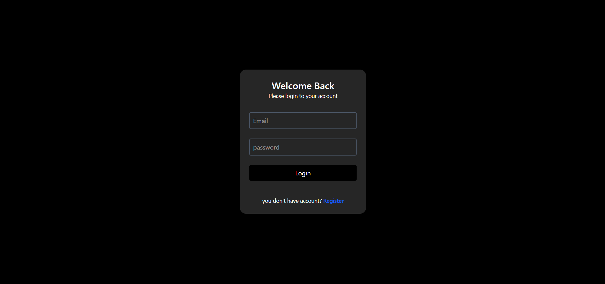
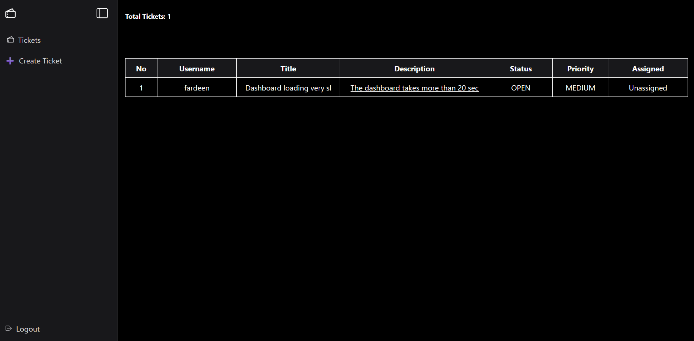
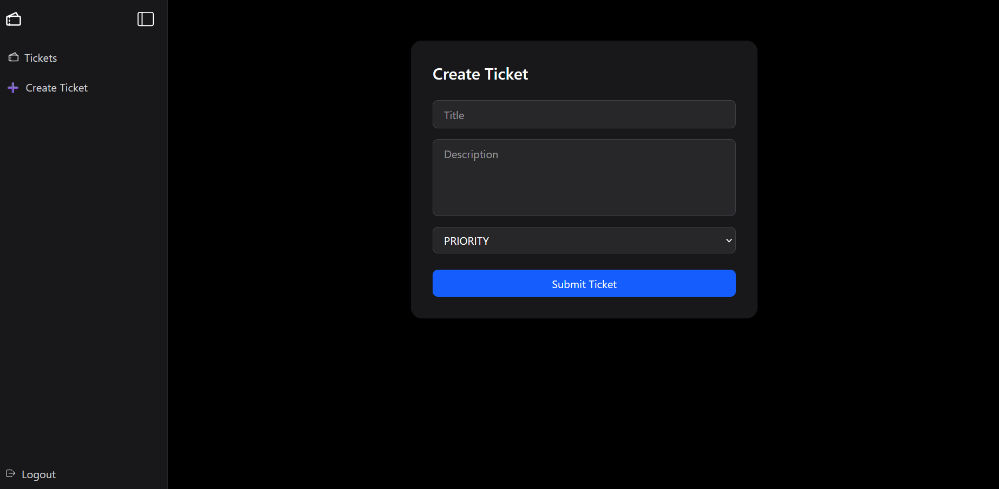
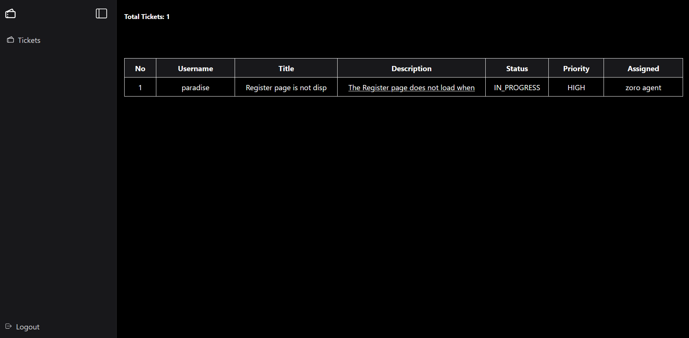
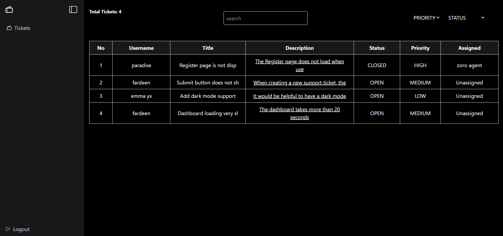
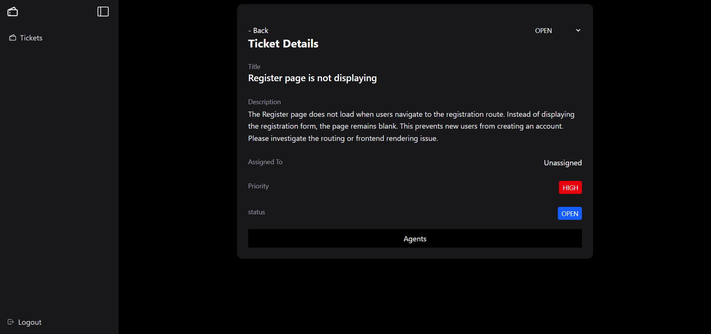
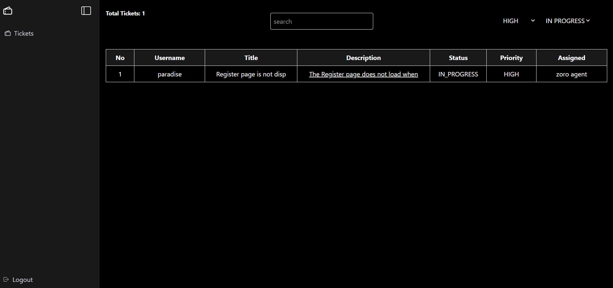

# Ticket Management System

## Summary

The Ticket Management System is an internal organizational tool designed to capture, track, and resolve issues through a structured role-based workflow. It replaces informal communication channels with a centralized system that improves accountability, visibility, and issue resolution.

The project focuses on system design, business logic, and role-based access control rather than simple CRUD operations, making it suitable for real-world enterprise applications.

---

## Problem Statement

In growing organizations, issues are often reported through informal channels such as WhatsApp groups or emails, leading to poor tracking, lack of accountability, and delayed resolution.

This application centralizes issue reporting and resolution using a structured role-based workflow.

---

## Objectives

- Design a Role-Based Access Control (RBAC) system
- Implement a real-world ticket lifecycle
- Apply business logic before coding
- Build a scalable full-stack application

---

## User Roles

- **User** – Creates and tracks support tickets
- **Agent** – Works on assigned tickets
- **Admin** – Manages users, ticket assignments, and workflows

---

## Tech Stack

### Frontend
- React.js
- Vite
- React Router DOM
- Tailwind CSS
- Zustand
- Axios
- React Hook Form
- Zod
- React Hot Toast
- React Icons

### Backend
- Node.js
- Express.js
- MongoDB
- Mongoose
- JWT Authentication
- bcryptjs
- Express Validator
- Cookie Parser
- CORS
- Morgan
- dotenv

### Deployment & Tools
- Git
- GitHub
- Render
- MongoDB Atlas

---

## Important Notes

Before using the application, please keep the following in mind:

1. Enable **third-party cookies** in your browser. Authentication uses cookies, so if third-party cookies are blocked, login and other protected features may not work correctly.

2. Both the frontend and backend are deployed on **Render's free plan**. The first request may take **30–60 seconds** while the services wake up.

---

## Live Demo

https://role-based-ticket-management-tool-1.onrender.com

---

## Demo Credentials

Use the following credentials to test the admin features.

### Admin Account

- **Email:** admin@gmail.com
- **Password:** admin123

> **Note:** These credentials are provided for demo purposes only.

---

## Environment Variables

Create a `.env` file in the root directory.

```env
MONGODB_URL=

PORT=

CORE_ORIGIN=http://localhost:5173

JWT_ACCESS_SECRET=JSONWEBTOKEN_ACCESS_SECRET
ACCESS_TOKEN_EXPIRED=1d

JWT_REFRESH_SECRET=JSONWEBTOKEN_REFRESH_SECRET
REFRESH_TOKEN_EXPIRED=7d
```

---

## API Endpoints

### Authentication

| Method | Endpoint | Description |
|--------|----------|-------------|
| POST | `/api/v1/user/register` | Register a new user |
| POST | `/api/v1/user/login` | Authenticate a user |
| POST | `/api/v1/user/logout` | Logout the authenticated user |
| GET | `/api/v1/user/me` | Get the authenticated user's profile |
| GET | `/api/v1/user/agent` | Get all agent users (Admin only) |

### Ticket Management

| Method | Endpoint | Description |
|--------|----------|-------------|
| POST | `/api/v1/ticket` | Create a new ticket |
| GET | `/api/v1/ticket/getTicket` | Retrieve tickets based on user role |
| GET | `/api/v1/ticket/:id` | Get ticket details |
| PATCH | `/api/v1/ticket/:id/update-status` | Update ticket status |
| GET | `/api/v1/ticket/search-users` | Search users (Admin only) |
| PATCH | `/api/v1/ticket/:ticketId/assigned` | Assign a ticket to an agent (Admin only) |

---

## Screenshots

### Login Page


### User Dashboard


### Create Ticket


### Agent Dashboard


### Admin Dashboard


### Assign Ticket


### Filter Tickets


---

## Project Timeline

- **Start Date:** January 2026
- **Completion Date:** March 2026
- **Status:** Completed
